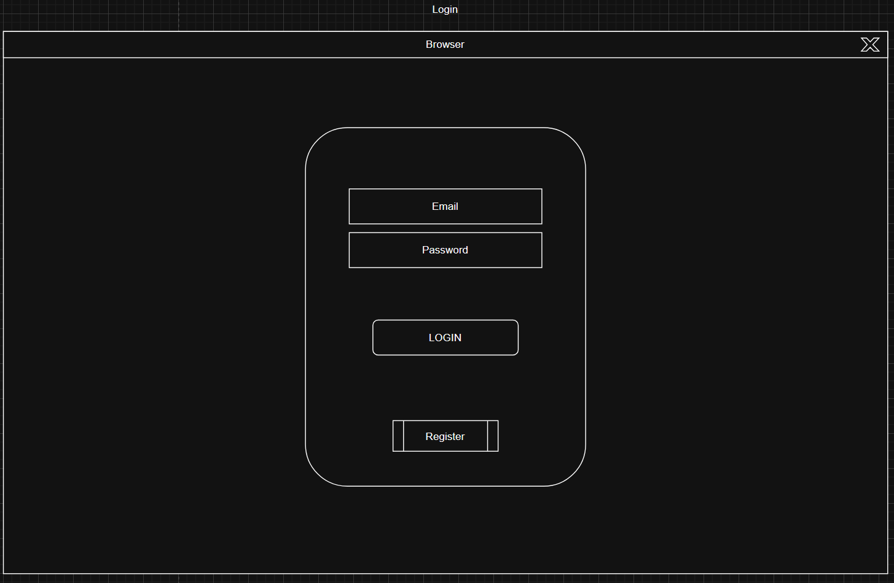
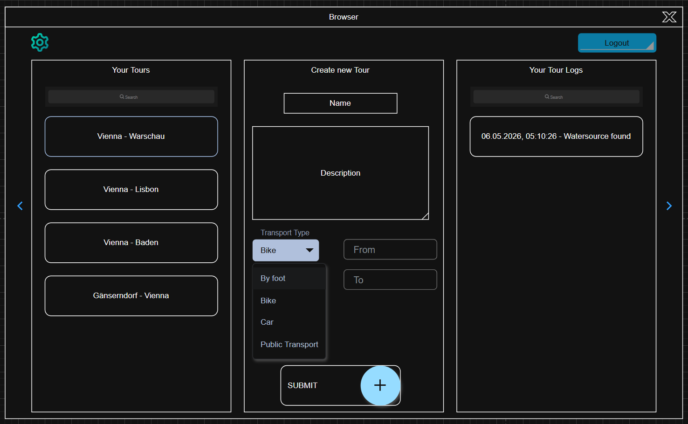

# Protocol

## Start the application
For the intermediate Hand-In, there is only the frontend-part of the application available.

Therefore, you need to go to `./cts.core.ui.tourplanner/frontend` and run the command `ng serve`.

Since the Login and Register only create a fake user and a cookie, every Login the userGuid changes, thus making it hard to see the created tours on the same account.

However, you can just refresh the page, the cookie will stay and you can see that the created tours persist.

## UI

### Login / Register page

The UI of the Login / Register page was not very sophisticated, hence why we decided to modernize our UI a little to fit the current standards.

### Home page

For the homepage, the design changed even more than the Login. The reason for this change is that we wanted to make the homepage more user-friendly and easier to navigate as well as understand. We added a sidebar for better navigation and a more modern, simple look.