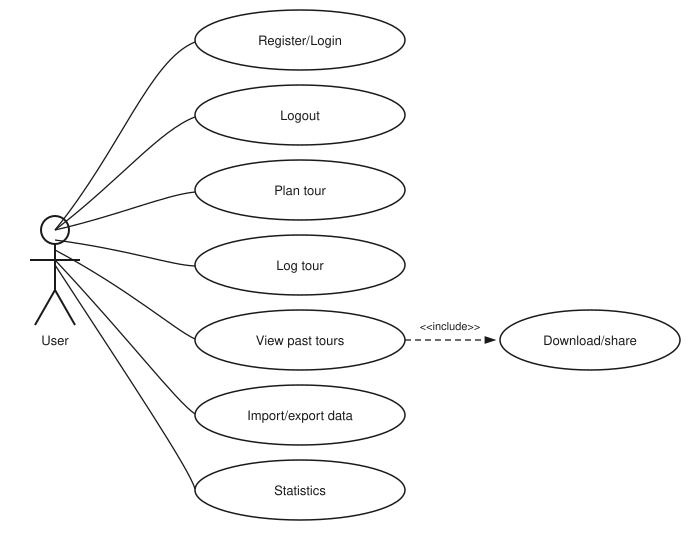
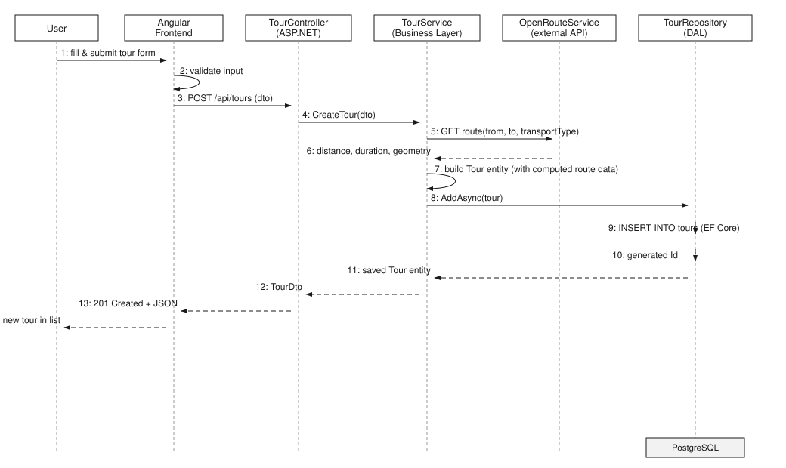

# **Protocol**

## GitHub Link
https://github.com/paul3572/ctrl-sprint

## Project Overview

The Tour Planner is a web-based application that allows users to create, manage and document tours. Every registered user can create tours, add tour logs, search through their data and import or export complete tour collections.

The application follows a client-server architecture consisting of an Angular frontend, an ASP.NET backend and a PostgreSQL database accessed through Entity Framework Core.

## How to start the application
In order to start the application, first go to the root of the project, then run `docker compose up postgres` to start the PostgreSQL database. After that, go to `cd .\cts.core.api.tourplanner\cts.core.api.tourguide\` and run `dotnet run` to start the backend. The Swagger UI is visible at localhost:8080.
And Finally, go to `cd .\cts.core.ui.tourplanner\frontend\` and run `ng serve` to start the frontend. The application is visible at localhost:4200.

---

# Application Architecture

The Tour Planner application follows a layered architecture consisting of three main layers. Each layer has a clearly defined responsibility and communicates only with the adjacent layer. This separation improves maintainability, testability, and extensibility.

## Presentation Layer

The presentation layer consists of the Angular frontend and the ASP.NET controllers.

### Angular Frontend
The frontend is responsible for:
- displaying the user interface
- validating user input
- communicating with the backend via HTTP
- rendering maps using Leaflet
- managing the application state

The frontend follows the MVVM pattern:
- **View** – Angular components and HTML templates
- **ViewModel** – Angular services which contain the presentation logic
- **Model** – TypeScript interfaces and DTOs

### ASP.NET Controllers
Controllers expose the REST API and act as the entry point for every client request. Their responsibilities are limited to:
- receiving HTTP requests
- validating request data
- calling the corresponding business service
- returning the appropriate HTTP response

Controllers intentionally contain no business logic.


## Business Layer

The business layer contains the application logic. It also communicates with external services such as OpenRouteService to calculate routes.

Its responsibilities include:
- validating business rules
- coordinating repository calls
- integrating external services
- calculating derived values
- converting domain objects into DTOs

Examples include:
- TourService
- TourLogService
- Authentication services
- OpenRouteService integration
- OpenMeteoService integration

The business layer is completely independent of the presentation layer.


## Data Access Layer

The data access layer is responsible for persistent storage.

Its responsibilities include:
- database access via Entity Framework Core
- CRUD operations
- loading related entities
- communication with PostgreSQL

Repositories encapsulate all database-specific code so that the business layer does not depend on Entity Framework directly.


## Overall Architecture

```
Angular Frontend
        │
     HTTP / JSON
        │
ASP.NET Controllers
        │
Business Services
        │
Repositories
        │
Entity Framework Core
        │
PostgreSQL Database
```

---

# Use Cases

## Use Case Diagram

The use case diagram shows a single actor, since the application does not distinguish between a guest and a registered state at runtime — every function requires an account, and registration/login is itself one of the use cases.



### Actor

| Actor | Description                                                                                                |
|-------|------------------------------------------------------------------------------------------------------------|
| User  | Person interacting with the application; registers/logs in and then manages their own tours, logs and data |

### Use Case Descriptions

| Use Case           | Description                                                                                                     |
|--------------------|-----------------------------------------------------------------------------------------------------------------|
| Register/Login     | Create a new account or authenticate with existing credentials                                                  |
| Logout             | End the current session                                                                                         |
| Plan tour          | Create, edit or delete a tour (name, description, from/to, transport type, distance, estimated time, route)     |
| Log tour           | Create, edit or delete a tour log for a completed tour (date/time, comment, difficulty, distance, time, rating) |
| View past tours    | Browse and full-text search tours and tour logs, including computed attributes (popularity, child-friendliness) |
| Download/share     | Export the data of a viewed tour; included in "View past tours" since it is only reachable from there           |
| Import/export data | Import or export the complete tour collection as a file                                                         |
| Statistics         | View aggregated statistics derived from tours and tour logs                                                     |


## Sequence Diagram: Tour Creation

The following diagram documents the flow triggered when a user creates a new tour. The business layer calls the OpenRouteService API to compute distance, duration and route geometry before persisting the tour.



**Notes on the flow:**
- Input validation happens client-side in the Angular frontend before the request is sent.
- `TourService` is responsible for calling the external OpenRouteService API and enriching the tour with the computed distance, duration and route geometry — this logic is intentionally kept out of the controller and repository.
- `TourRepository` only handles persistence via Entity Framework Core and has no knowledge of OpenRouteService.
- The response is propagated back up through the layers as a DTO, keeping the EF Core entity internal to the business/data layers.

---

## UI

### Login / Register page

The UI of the Login / Register page was not very sophisticated, hence why we decided to modernize our UI a little to fit the current standards.


### Home page

For the homepage, the design changed even more than the Login. The reason for this change is that we wanted to make the homepage more user-friendly and easier to navigate as well as understand. We added a sidebar for better navigation and a more modern, simple look.

---

# External Libraries

The project uses several external libraries.

| Library               | Purpose              |
|-----------------------|----------------------|
| Entity Framework Core | ORM                  |
| Npgsql                | PostgreSQL Database  |
| Leaflet               | Interactive maps     |
| OpenRouteService      | Route calculation    |
| Serilog               | Structured logging   |
| JWT Authentication    | User authentication  |
| NUnit                 | Unit testing         |
| Swashbuckle           | Swagger UI           |
| Moq                   | Mocking dependencies |

## Library Decisions

### Entity Framework Core & Npgsql
Entity Framework Core was chosen as the Object-Relational Mapper (ORM) to access the PostgreSQL database. It provides strongly typed entities, LINQ support, and automatic database migrations, which significantly reduce the amount of manual SQL code.

### Leaflet
Leaflet was chosen to display interactive maps in the frontend. It is lightweight, easy to integrate into Angular, and provides all functionality required to visualize calculated routes.

### JWT Authentication
Authentication is implemented using JSON Web Tokens (JWT). After a successful login or registration, the backend creates a signed JWT which is stored in an HTTP-only cookie. This allows stateless authentication while protecting the token from JavaScript access.

### Serilog
Serilog was integrated as the logging framework. It provides structured logging and supports multiple output targets such as the console and log files. During development it was mainly used for debugging, monitoring requests, and simplifying error analysis.

### Swashbuckle (Swagger UI)
Swashbuckle automatically generates an OpenAPI specification and provides an interactive Swagger UI. This made it possible to test API endpoints directly in the browser without creating separate test clients, which greatly simplified backend development and debugging.

### NUnit & Moq
NUnit was used for unit testing while Moq was used to create mock implementations of dependencies. This allowed isolated testing of business logic without requiring a running database or external services.

## Lessons Learned

### Entity Framework Core & Npgsql
Migrations turned out to be more fragile than expected once multiple developers worked on the same model at the same time. That's why we just decided to redo it work with code-first, which definitely paid off.

### OpenRouteService Integration
The API's rate limits and occasional response delays meant that route calculation could not simply be called synchronously without error handling. That's why we implemented a mock-implementation using the same interface, which allowed us to test the application without hitting the API too often and also made it possible to simulate different scenarios.

### Leaflet
Integrating a plain JavaScript library like Leaflet into Angular's component lifecycle required extra care — the map has to be initialized after the DOM element exists and cleaned up when the component is destroyed, otherwise it didn't work once it was called again.

### JWT Authentication
First we wanted to do authentication using Cookies. However, we decided to go the JWT way, since it is more secure and easier to implement. We also learned that the stateless nature of JWT means that the backend cannot invalidate tokens, which is why we had to implement a token refresh mechanism to allow users to log out and refresh their session.

### Serilog
Structured logging only pays off once a consistent logging convention is established. Early on, log messages were inconsistent in detail and level (Info vs. Debug vs. Error), which made it harder to filter relevant information — a clearer logging convention was introduced later in the project.

### NUnit & Moq
Mocking the repository layer made business logic tests fast and independent of the database, but it also revealed how important clean interface boundaries are — wherever the business layer directly used EF Core types instead of DTOs/interfaces, tests became noticeably harder to write and had to be refactored.

---

# Design Patterns

Several design patterns were used throughout the project.

## Repository Pattern

Repositories encapsulate database access and hide Entity Framework implementation details from the business logic.

Examples:

- UserRepository
- TourRepository
- TransportRepository

Advantages:

- separation of concerns
- easier testing
- database implementation can be replaced with minimal changes

---

## Facade Pattern

The frontend uses a facade for the map implementation.

Example:

- MapFacadeService

Instead of directly interacting with Leaflet throughout the application, all map-related functionality is centralized in one service.

Advantages:

- simplified API
- reusable logic
- easier maintenance

---

## Unit Testing Decisions

The project includes more than 20 unit tests implemented with NUnit. The purpose of these tests is to verify the correctness of the application's business logic independently of the user interface and the database.

The primary focus was placed on the business layer, since it contains the application's most critical logic. Testing the business layer ensures that application rules remain correct even if the presentation layer changes.

The following components were tested:

- Authentication services (registration and login)
- Tour service
- Tour log service
- Repository interactions using mocked dependencies
- Validation of exceptional situations (e.g. invalid input or missing entities)

External dependencies such as the database, the OpenRouteService API, and logging were replaced with mocks using the Moq framework. This keeps the tests deterministic, fast, and independent from external systems.

Particular attention was given to testing both successful and failing scenarios. Besides verifying expected results, the tests also ensure that custom exceptions are thrown correctly when invalid operations are performed.

Testing these components provides confidence that the application's core functionality behaves correctly while allowing future changes to be made with a lower risk of introducing regressions.

---

# Unique Feature

Our unique feature contained the implementation of a call to the OpenMeteoService. This service retrieves the current weather for a given location (consisting of latitude and longitude) and returns the temperature and weather code. The weather code is then mapped to a human-readable description (e.g., "Clear sky", "Rain", etc.) and displayed in the tour details for the locations of the starting point and destination.